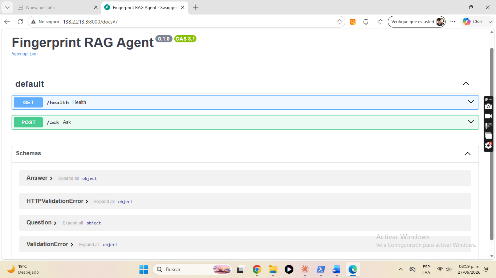
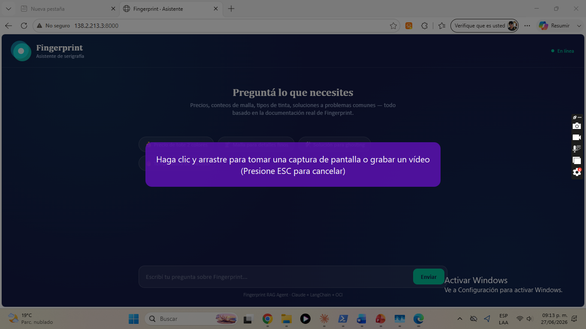

# Fingerprint RAG Agent

Agente de IA que responde preguntas sobre la empresa de serigrafía **Fingerprint** (Asunción, Paraguay), construido con LangChain + Claude + ChromaDB para el challenge Oracle ONE / Alura.

## Stack

| Componente | Tecnología |
|---|---|
| LLM | Claude Sonnet 4.6 (Anthropic API) |
| Embeddings | `all-MiniLM-L6-v2` (sentence-transformers, local) |
| Vector store | ChromaDB (persistido en disco) |
| Orquestación | LangChain (LCEL) |
| API | FastAPI + Uvicorn |
| Fuente de datos | `FINGERPRINT.pdf` (12 páginas) |

## Estructura

```
alura-challenge-fingerprint/
├── FINGERPRINT.pdf              ← fuente de conocimiento
├── app/
│   ├── __init__.py
│   ├── main.py                  ← FastAPI: endpoints /ask y /health
│   ├── agent.py                 ← cadena RAG (LangChain + Claude)
│   ├── ingest.py                ← indexa el PDF en ChromaDB
│   └── extract_pdf.py           ← extrae texto de PDFs escaneados via Claude
├── data/
│   └── chroma_db/               ← índice vectorial (generado por ingest.py)
├── .env                         ← ANTHROPIC_API_KEY (no se sube al repo)
├── .env.example
├── .gitignore
└── requirements.txt
```

## Setup

```bash
# 1. Clonar y entrar a la carpeta
cd alura-challenge-fingerprint

# 2. Crear entorno virtual
python -m venv .venv
.venv\Scripts\Activate.ps1        # Windows PowerShell

# 3. Instalar dependencias
pip install -r requirements.txt

# 4. Crear .env con tu API key de Anthropic
echo ANTHROPIC_API_KEY=sk-ant-... > .env

# 5. Indexar el PDF (solo la primera vez)
python -m app.ingest

# 6. Levantar el servidor
uvicorn app.main:app --port 8000
```

## Deploy en producción

El agente está desplegado en OCI Compute (Ubuntu 22.04):

| | |
|---|---|
| **Servidor** | `http://138.2.213.3:8000` |
| **Health check** | http://138.2.213.3:8000/health |
| **Documentación** | http://138.2.213.3:8000/docs |



### Interfaz de chat

La aplicación incluye una interfaz de chat accesible en `http://138.2.213.3:8000`:



### Pasos del deploy en OCI

**1. Crear la instancia**
- OCI Compute → Ubuntu 22.04 → shape VM.Standard.E2.1.Micro (1 GB RAM)
- Descargar la clave SSH al crear la instancia

**2. Abrir el puerto 8000**
- Networking → Virtual Cloud Networks → Default Security List
- Agregar Ingress Rule: Source `0.0.0.0/0`, TCP, puerto `8000`

**3. Configurar swap (necesario con 1 GB RAM)**
```bash
sudo fallocate -l 2G /swapfile
sudo chmod 600 /swapfile
sudo mkswap /swapfile
sudo swapon /swapfile
echo '/swapfile none swap sw 0 0' | sudo tee -a /etc/fstab
```

**4. Clonar el repo y crear el entorno virtual**
```bash
git clone https://github.com/ksegovia81/alura-challenge-fingerprint.git
cd alura-challenge-fingerprint
python3 -m venv .venv
```

**5. Crear el `.env` con la API key**
```bash
echo "ANTHROPIC_API_KEY=sk-ant-..." > .env
```

**6. Instalar dependencias**
```bash
.venv/bin/pip install -r requirements.txt
```

**7. Indexar el PDF**
```bash
.venv/bin/python -m app.ingest
```

**8. Configurar el servicio systemd**
```bash
sudo tee /etc/systemd/system/fingerprint.service << 'EOF'
[Unit]
Description=Fingerprint RAG Agent
After=network.target

[Service]
User=ubuntu
WorkingDirectory=/home/ubuntu/alura-challenge-fingerprint
ExecStart=/home/ubuntu/alura-challenge-fingerprint/.venv/bin/uvicorn app.main:app --host 0.0.0.0 --port 8000
Restart=always

[Install]
WantedBy=multi-user.target
EOF
sudo systemctl daemon-reload
sudo systemctl enable fingerprint
sudo systemctl start fingerprint
```

**9. Abrir el puerto 8000 en iptables**

OCI Ubuntu bloquea por defecto todo tráfico entrante excepto el puerto 22. Hay que agregar una regla a nivel de SO:
```bash
sudo iptables -I INPUT 4 -p tcp --dport 8000 -j ACCEPT
sudo netfilter-persistent save
```

## Uso

### Health check
```bash
GET http://localhost:8000/health
# {"status": "ok"}
```

### Hacer una pregunta
```bash
POST http://localhost:8000/ask
Content-Type: application/json

{"question": "¿Qué productos ofrece Fingerprint?"}
```

```json
{
  "answer": "Fingerprint ofrece remeras, bolsas tote, ponchos, textiles, merchandising personalizado y stickers de vinilo..."
}
```

## Ejemplos de respuestas

**¿Cuánto cuesta una bolsa tote de 2 colores?**
> Una bolsa tote canvas de 2 colores, en cantidad de 50 o más unidades, cuesta **Gs. 45.000 por unidad**. Pueden aplicarse recargos: pedido urgente (menos de 48 horas) +25%, cantidad pequeña (menos de 20 unidades) +30%.

**¿Qué malla recomiendan para detalles finos en canvas?**
> Para detalles finos en canvas, Fingerprint recomienda usar **malla 180 (71T)**.

**¿Cómo se soluciona el problema de ghosting?**
> Usar **removedor de haze** después de recuperar la malla, dejar actuar 5 minutos y fregar. El removedor es cáustico — usar guantes de goma y tener lavaojos cerca.

**¿Qué temperatura de curado necesita la tinta plastisol?**
> La tinta plastisol necesita **160°C (320°F) por un mínimo de 60 segundos**. Verificar con termómetro de sonda: la impresión no debe estar pegajosa y debe estirarse levemente sin agrietarse.

## Cómo funciona

```
Pregunta del usuario
       ↓
  FastAPI /ask
       ↓
 ChromaDB retriever  →  recupera 4 chunks relevantes del PDF
       ↓
  Prompt con contexto
       ↓
  Claude Sonnet 4.6  →  genera respuesta basada en el contexto
       ↓
     Respuesta
```

El sistema usa RAG (Retrieval Augmented Generation): en vez de responder desde su entrenamiento general, Claude responde únicamente con información extraída del dossier de Fingerprint. Si la respuesta no está en el documento, lo dice claramente.